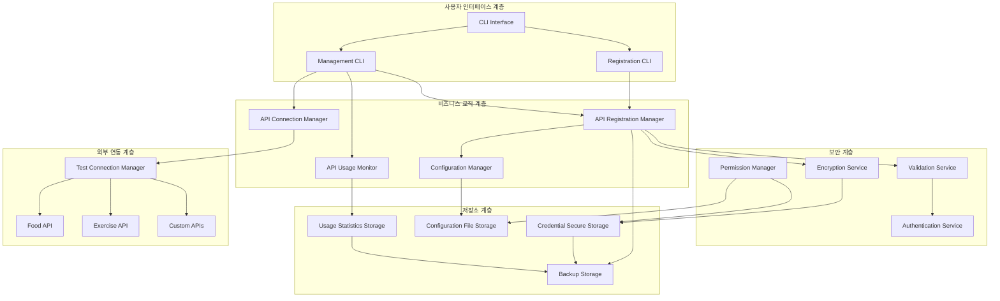

# Design Document

## Overview

API 등록 관리 시스템은 사용자가 음식 및 운동 관련 외부 API를 쉽고 안전하게 등록, 관리, 모니터링할 수 있는 통합 플랫폼입니다. 기존 AuthController를 확장하여 암호화된 저장소, 연결 테스트, 사용량 모니터링, 백업/복원 기능을 제공합니다.

시스템은 보안을 최우선으로 하여 API 키를 AES-256 암호화로 저장하고, 파일 권한 관리, 무결성 검증을 통해 민감한 정보를 보호합니다. 또한 직관적인 CLI 인터페이스를 통해 개발자가 쉽게 API를 등록하고 관리할 수 있도록 설계되었습니다.

## Architecture

### 전체 시스템 아키텍처



### 계층별 역할

1. **사용자 인터페이스**: CLI 명령어를 통한 직관적인 API 관리
2. **비즈니스 로직**: API 등록, 연결 관리, 사용량 모니터링 핵심 기능
3. **보안 계층**: 암호화, 검증, 인증, 권한 관리
4. **저장소 계층**: 안전한 데이터 저장 및 백업
5. **외부 연동**: API 연결 테스트 및 상태 확인

## Components and Interfaces

### 1. API 등록 관리 컴포넌트

#### APIRegistrationManager

```python
class APIRegistrationManager:
    """API 등록 및 관리 핵심 클래스"""

    def __init__(self, encryption_service: EncryptionService,
                 storage: CredentialSecureStorage,
                 validator: ValidationService):
        self.encryption = encryption_service
        self.storage = storage
        self.validator = validator
        self.supported_providers = self._load_supported_providers()

    def register_api(self, provider_name: str, credentials: dict) -> RegistrationResult:
        """새로운 API 등록"""

    def update_api_credentials(self, api_id: str, new_credentials: dict) -> bool:
        """API 자격증명 업데이트"""

    def remove_api(self, api_id: str, confirm: bool = False) -> bool:
        """API 등록 해제"""

    def list_registered_apis(self) -> List[APIInfo]:
        """등록된 API 목록 조회"""

    def get_api_details(self, api_id: str) -> APIDetails:
        """특정 API 상세 정보 조회"""

    def export_configuration(self, output_path: str, include_sensitive: bool = False) -> ExportResult:
        """설정 내보내기"""

    def import_configuration(self, config_path: str, overwrite: bool = False) -> ImportResult:
        """설정 가져오기"""
```

#### APIConnectionManager

```python
class APIConnectionManager:
    """API 연결 테스트 및 상태 관리"""

    def __init__(self, test_manager: TestConnectionManager,
                 monitor: APIUsageMonitor):
        self.test_manager = test_manager
        self.monitor = monitor

    def test_connection(self, api_id: str, timeout: int = 30) -> ConnectionTestResult:
        """API 연결 테스트"""

    def test_all_connections(self) -> Dict[str, ConnectionTestResult]:
        """모든 등록된 API 연결 테스트"""

    def get_connection_status(self, api_id: str) -> ConnectionStatus:
        """API 연결 상태 조회"""

    def diagnose_connection_issues(self, api_id: str) -> DiagnosisResult:
        """연결 문제 진단"""

    def suggest_solutions(self, error_type: str, api_provider: str) -> List[str]:
        """문제 해결 방안 제안"""
```

### 2. 보안 컴포넌트

#### EncryptionService

```python
class EncryptionService:
    """AES-256 기반 암호화 서비스"""

    def __init__(self, key_derivation_method: str = "PBKDF2"):
        self.cipher_suite = None
        self.key_derivation = key_derivation_method
        self._initialize_encryption()

    def encrypt_credentials(self, credentials: dict, master_password: str = None) -> EncryptedData:
        """자격증명 암호화"""

    def decrypt_credentials(self, encrypted_data: EncryptedData, master_password: str = None) -> dict:
        """자격증명 복호화"""

    def generate_master_key(self) -> str:
        """마스터 키 생성"""

    def rotate_encryption_key(self, old_password: str, new_password: str) -> bool:
        """암호화 키 교체"""

    def verify_integrity(self, encrypted_data: EncryptedData) -> bool:
        """데이터 무결성 검증"""
```

#### ValidationService

```python
class ValidationService:
    """API 자격증명 및 설정 검증"""

    def __init__(self):
        self.validation_rules = self._load_validation_rules()

    def validate_api_credentials(self, provider: str, credentials: dict) -> ValidationResult:
        """API 자격증명 형식 검증"""

    def validate_api_key_format(self, provider: str, api_key: str) -> bool:
        """API 키 형식 검증"""

    def validate_endpoint_url(self, url: str) -> bool:
        """엔드포인트 URL 검증"""

    def validate_configuration(self, config: dict) -> ValidationResult:
        """전체 설정 검증"""

    def get_validation_rules(self, provider: str) -> dict:
        """제공업체별 검증 규칙 조회"""
```

### 3. 저장소 컴포넌트

#### CredentialSecureStorage

```python
class CredentialSecureStorage:
    """암호화된 자격증명 저장소"""

    def __init__(self, storage_path: str, encryption_service: EncryptionService,
                 permission_manager: PermissionManager):
        self.storage_path = Path(storage_path)
        self.encryption = encryption_service
        self.permissions = permission_manager
        self._ensure_secure_storage()

    def store_credentials(self, api_id: str, credentials: dict) -> bool:
        """자격증명 저장"""

    def retrieve_credentials(self, api_id: str) -> dict:
        """자격증명 조회"""

    def update_credentials(self, api_id: str, new_credentials: dict) -> bool:
        """자격증명 업데이트"""

    def delete_credentials(self, api_id: str) -> bool:
        """자격증명 삭제"""

    def list_stored_apis(self) -> List[str]:
        """저장된 API 목록"""

    def backup_storage(self, backup_path: str) -> bool:
        """저장소 백업"""

    def restore_storage(self, backup_path: str) -> bool:
        """저장소 복원"""

    def verify_storage_integrity(self) -> IntegrityResult:
        """저장소 무결성 검증"""
```

#### APIUsageMonitor

```python
class APIUsageMonitor:
    """API 사용량 모니터링"""

    def __init__(self, storage_path: str):
        self.storage_path = Path(storage_path)
        self.usage_data = {}
        self._load_usage_data()

    def record_api_call(self, api_id: str, endpoint: str, success: bool,
                       response_time: float) -> None:
        """API 호출 기록"""

    def get_usage_statistics(self, api_id: str, period: str = "daily") -> UsageStats:
        """사용량 통계 조회"""

    def get_all_usage_statistics(self, period: str = "daily") -> Dict[str, UsageStats]:
        """전체 API 사용량 통계"""

    def check_rate_limits(self, api_id: str) -> RateLimitStatus:
        """속도 제한 확인"""

    def generate_usage_report(self, start_date: datetime, end_date: datetime) -> UsageReport:
        """사용량 리포트 생성"""

    def get_performance_metrics(self, api_id: str) -> PerformanceMetrics:
        """성능 지표 조회"""

    def alert_on_unusual_usage(self, api_id: str) -> List[Alert]:
        """비정상 사용량 알림"""
```

### 4. 데이터 모델

#### APIProvider

```python
@dataclass
class APIProvider:
    """API 제공업체 정보"""
    name: str
    display_name: str
    base_url: str
    auth_type: str  # "api_key", "oauth", "basic_auth"
    required_fields: List[str]
    optional_fields: List[str]
    test_endpoint: str
    documentation_url: str
    rate_limits: dict

    def validate_credentials(self, credentials: dict) -> bool:
        """자격증명 유효성 검사"""

    def get_test_request(self) -> dict:
        """테스트 요청 정보 반환"""
```

#### APIRegistration

```python
@dataclass
class APIRegistration:
    """API 등록 정보"""
    api_id: str
    provider: APIProvider
    credentials: dict  # 암호화된 상태로 저장
    configuration: dict
    created_at: datetime
    updated_at: datetime
    last_tested: Optional[datetime]
    status: str  # "active", "inactive", "error"

    def is_active(self) -> bool:
        """활성 상태 확인"""

    def needs_testing(self) -> bool:
        """테스트 필요 여부"""

    def to_dict(self, include_sensitive: bool = False) -> dict:
        """딕셔너리 변환"""
```

#### ConnectionTestResult

```python
@dataclass
class ConnectionTestResult:
    """연결 테스트 결과"""
    api_id: str
    success: bool
    response_time: float
    status_code: Optional[int]
    error_message: Optional[str]
    error_type: Optional[str]
    tested_at: datetime
    suggestions: List[str]

    def is_healthy(self) -> bool:
        """건강 상태 확인"""

    def get_status_summary(self) -> str:
        """상태 요약"""
```

### 5. CLI 인터페이스 컴포넌트

#### RegistrationCLI

```python
class RegistrationCLI:
    """API 등록 CLI 인터페이스"""

    def __init__(self, registration_manager: APIRegistrationManager):
        self.manager = registration_manager

    def interactive_registration(self) -> None:
        """대화형 API 등록"""

    def register_command(self, provider: str, **kwargs) -> None:
        """명령줄 API 등록"""

    def list_providers_command(self) -> None:
        """지원 제공업체 목록"""

    def show_provider_info(self, provider: str) -> None:
        """제공업체 정보 표시"""
```

#### ManagementCLI

```python
class ManagementCLI:
    """API 관리 CLI 인터페이스"""

    def __init__(self, registration_manager: APIRegistrationManager,
                 connection_manager: APIConnectionManager,
                 usage_monitor: APIUsageMonitor):
        self.registration = registration_manager
        self.connection = connection_manager
        self.usage = usage_monitor

    def list_apis_command(self) -> None:
        """등록된 API 목록"""

    def show_api_details(self, api_id: str) -> None:
        """API 상세 정보"""

    def test_connection_command(self, api_id: str = None) -> None:
        """연결 테스트"""

    def update_credentials_command(self, api_id: str) -> None:
        """자격증명 업데이트"""

    def remove_api_command(self, api_id: str) -> None:
        """API 제거"""

    def show_usage_stats(self, api_id: str = None, period: str = "daily") -> None:
        """사용량 통계"""

    def export_config_command(self, output_path: str, include_sensitive: bool = False) -> None:
        """설정 내보내기"""

    def import_config_command(self, config_path: str, overwrite: bool = False) -> None:
        """설정 가져오기"""
```

## Data Models

### 저장소 스키마

#### 암호화된 자격증명 저장 형식

```json
{
  "version": "1.0",
  "encryption": {
    "algorithm": "AES-256-GCM",
    "key_derivation": "PBKDF2",
    "salt": "base64_encoded_salt",
    "iterations": 100000
  },
  "apis": {
    "food_api_001": {
      "provider": "food_safety_korea",
      "encrypted_credentials": "base64_encoded_encrypted_data",
      "configuration": {
        "timeout": 30,
        "retry_count": 3,
        "rate_limit": 1000
      },
      "metadata": {
        "created_at": "2025-01-23T10:00:00Z",
        "updated_at": "2025-01-23T10:00:00Z",
        "last_tested": "2025-01-23T10:05:00Z",
        "status": "active"
      },
      "integrity_hash": "sha256_hash"
    }
  },
  "global_settings": {
    "auto_test_interval": 3600,
    "backup_retention": 30,
    "log_level": "INFO"
  }
}
```

#### API 제공업체 정의

```json
{
  "providers": {
    "food_safety_korea": {
      "name": "food_safety_korea",
      "display_name": "식약처 식품영양성분 API",
      "base_url": "https://openapi.foodsafetykorea.go.kr/api",
      "auth_type": "api_key",
      "required_fields": ["api_key"],
      "optional_fields": ["service_id"],
      "test_endpoint": "/I2790/json/C003/1/1",
      "documentation_url": "https://www.foodsafetykorea.go.kr/api/openApiInfo.do",
      "rate_limits": {
        "requests_per_second": 10,
        "requests_per_day": 1000
      },
      "validation_rules": {
        "api_key": {
          "min_length": 20,
          "max_length": 50,
          "pattern": "^[A-Za-z0-9]+$"
        }
      }
    },
    "k_health_exercise": {
      "name": "k_health_exercise",
      "display_name": "한국건강증진개발원 운동 API",
      "base_url": "https://openapi.k-health.or.kr/api",
      "auth_type": "api_key",
      "required_fields": ["api_key"],
      "optional_fields": [],
      "test_endpoint": "/exercise/list",
      "documentation_url": "https://www.k-health.or.kr/api/guide",
      "rate_limits": {
        "requests_per_second": 5,
        "requests_per_day": 500
      },
      "validation_rules": {
        "api_key": {
          "min_length": 15,
          "max_length": 40,
          "pattern": "^[A-Za-z0-9\\-_]+$"
        }
      }
    }
  }
}
```

#### 사용량 통계 저장 형식

```json
{
  "api_id": "food_api_001",
  "date": "2025-01-23",
  "statistics": {
    "total_calls": 150,
    "successful_calls": 145,
    "failed_calls": 5,
    "average_response_time": 1.2,
    "max_response_time": 3.5,
    "min_response_time": 0.8,
    "error_breakdown": {
      "timeout": 2,
      "auth_error": 1,
      "rate_limit": 2
    },
    "hourly_distribution": {
      "00": 5,
      "01": 3,
      "02": 1,
      "03": 0,
      "09": 25,
      "10": 30,
      "11": 28,
      "12": 20
    }
  }
}
```

## Error Handling

### 오류 처리 전략

#### 보안 관련 오류

```python
class SecurityErrorHandler:
    def handle_encryption_error(self, error: EncryptionError) -> str:
        """암호화 오류 처리"""
        error_messages = {
            "key_not_found": "암호화 키를 찾을 수 없습니다. 마스터 패스워드를 확인해주세요.",
            "decryption_failed": "복호화에 실패했습니다. 데이터가 손상되었을 수 있습니다.",
            "integrity_check_failed": "데이터 무결성 검증에 실패했습니다. 백업에서 복원을 고려해주세요.",
            "key_rotation_failed": "키 교체에 실패했습니다. 이전 키로 롤백합니다."
        }
        return error_messages.get(error.error_type, f"보안 오류: {str(error)}")

    def suggest_security_solutions(self, error_type: str) -> List[str]:
        """보안 문제 해결 방안"""
        solutions = {
            "key_not_found": [
                "마스터 패스워드 재설정",
                "백업에서 키 복원",
                "새로운 암호화 키 생성"
            ],
            "integrity_check_failed": [
                "백업 파일에서 복원",
                "손상된 데이터 재등록",
                "시스템 무결성 검사 실행"
            ]
        }
        return solutions.get(error_type, ["기술 지원팀에 문의하세요."])
```

#### API 연결 오류

```python
class ConnectionErrorHandler:
    def diagnose_connection_error(self, error: ConnectionError, api_id: str) -> DiagnosisResult:
        """연결 오류 진단"""

    def get_troubleshooting_steps(self, error_type: str, provider: str) -> List[str]:
        """문제 해결 단계"""

    def suggest_alternative_endpoints(self, provider: str) -> List[str]:
        """대체 엔드포인트 제안"""
```

#### 데이터 검증 오류

- 필수 필드 누락 시 사용자에게 명확한 안내
- 잘못된 형식 시 올바른 형식 예시 제공
- 중복 등록 시 기존 데이터 업데이트 옵션 제공

## Testing Strategy

### 보안 테스트

- 암호화/복호화 정확성 테스트
- 키 교체 시나리오 테스트
- 무결성 검증 테스트
- 권한 관리 테스트

### 통합 테스트

- 실제 API 연동 테스트 (샌드박스 환경)
- 전체 등록-테스트-사용 플로우 테스트
- 백업/복원 기능 테스트
- CLI 인터페이스 테스트

### 성능 테스트

- 대량 API 등록 성능 측정
- 암호화/복호화 성능 테스트
- 동시 접근 처리 테스트
- 메모리 사용량 모니터링

### 보안 감사

- 민감한 데이터 노출 검사
- 파일 권한 검증
- 로그에서 민감 정보 제거 확인
- 암호화 강도 검증

### 테스트 시나리오

```python
# 보안 테스트 시나리오
SECURITY_TEST_SCENARIOS = [
    {
        "name": "암호화 키 교체",
        "steps": ["기존 데이터 암호화", "키 교체", "데이터 복호화 확인"],
        "expected": "모든 데이터가 새 키로 정상 복호화"
    },
    {
        "name": "무결성 검증",
        "steps": ["데이터 저장", "파일 변조", "무결성 검사"],
        "expected": "변조 감지 및 오류 보고"
    }
]

# API 연결 테스트 시나리오
CONNECTION_TEST_SCENARIOS = [
    {
        "name": "정상 연결",
        "api_key": "valid_key",
        "expected_status": "success",
        "expected_response_time": "< 3초"
    },
    {
        "name": "잘못된 키",
        "api_key": "invalid_key",
        "expected_status": "auth_error",
        "expected_message": "인증 실패"
    }
]
```

### 검증 기준

- 암호화/복호화 성공률 100%
- API 연결 테스트 응답 시간 < 5초
- 데이터 무결성 검증 정확도 100%
- CLI 명령어 응답 시간 < 1초
- 메모리 사용량 < 100MB (일반적인 사용 시)
- 파일 권한 설정 정확도 100%

## Security Considerations

### 데이터 보호

- **암호화**: AES-256-GCM을 사용한 강력한 암호화
- **키 관리**: PBKDF2를 통한 안전한 키 유도
- **솔트**: 각 암호화마다 고유한 솔트 사용
- **무결성**: HMAC을 통한 데이터 무결성 보장

### 접근 제어

- **파일 권한**: 소유자만 읽기/쓰기 가능 (600)
- **디렉토리 권한**: 소유자만 접근 가능 (700)
- **마스터 패스워드**: 선택적 추가 보안 계층

### 감사 및 로깅

- **접근 로그**: 모든 자격증명 접근 기록
- **변경 로그**: 설정 변경 이력 추적
- **오류 로그**: 보안 관련 오류 상세 기록
- **민감 정보 제거**: 로그에서 API 키 등 민감 정보 마스킹

### 백업 보안

- **암호화된 백업**: 백업 파일도 동일한 수준으로 암호화
- **백업 무결성**: 백업 파일 무결성 검증
- **보관 기간**: 설정 가능한 백업 보관 기간
- **안전한 전송**: 백업 파일 전송 시 추가 암호화
