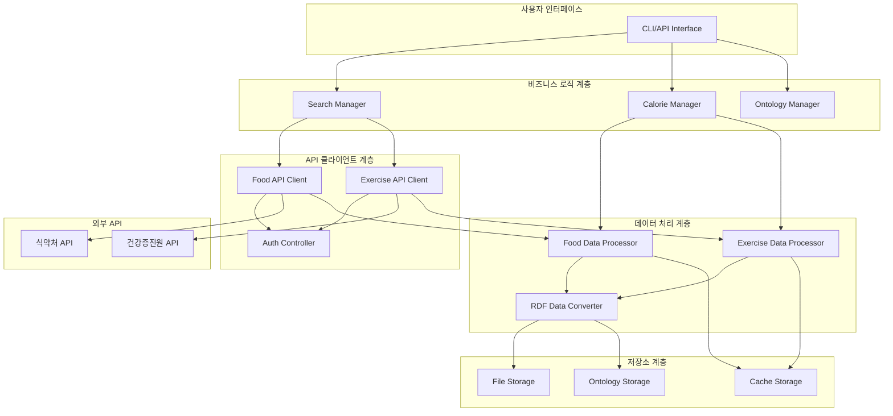

# Design Document

## Overview

이 시스템은 식약처 식품영양성분 API와 한국건강증진개발원 운동 API를 통합하여 실시간 영양 및 운동 데이터를 RDF/OWL 온톨로지로 변환하고 관리하는 통합 플랫폼입니다. 기존 diet-ontology.ttl을 확장하여 음식과 운동 데이터를 체계적으로 관리하고, 사용자의 칼로리 섭취와 소모를 통합 분석하여 순 칼로리(net calories) 계산 기능을 제공합니다.

시스템은 모듈화된 아키텍처를 채택하여 확장성과 유지보수성을 보장하며, 캐싱과 오류 처리를 통해 안정적인 API 연동을 지원합니다.

## Architecture

### 전체 시스템 아키텍처



### 계층별 역할

1. **사용자 인터페이스**: CLI 명령어 및 프로그래밍 API 제공
2. **비즈니스 로직**: 검색, 칼로리 계산, 온톨로지 관리 핵심 기능
3. **API 클라이언트**: 외부 API 연동 및 인증 처리
4. **데이터 처리**: API 응답 파싱, 검증, RDF 변환
5. **저장소**: 캐싱, 파일 저장, 온톨로지 관리

## Components and Interfaces

### 1. API 클라이언트 컴포넌트

#### FoodAPIClient

```python
class FoodAPIClient:
    """식약처 식품영양성분 API 클라이언트"""

    def __init__(self, api_key: str, base_url: str)
    def search_food(self, food_name: str) -> List[FoodItem]
    def get_nutrition_info(self, food_id: str) -> NutritionInfo
    def _handle_api_response(self, response: requests.Response) -> dict
    def _validate_api_key(self) -> bool
```

#### ExerciseAPIClient

```python
class ExerciseAPIClient:
    """한국건강증진개발원 운동 API 클라이언트"""

    def __init__(self, api_key: str, base_url: str)
    def search_exercise(self, exercise_name: str) -> List[ExerciseItem]
    def get_exercise_details(self, exercise_id: str) -> ExerciseDetails
    def _parse_met_value(self, exercise_data: dict) -> float
```

#### AuthController

```python
class AuthController:
    """API 인증 및 키 관리"""

    def load_api_keys(self) -> dict
    def validate_credentials(self, api_name: str) -> bool
    def handle_auth_error(self, error: AuthError) -> str
    def refresh_token_if_needed(self, api_name: str) -> bool
```

### 2. 데이터 모델

#### FoodItem

```python
@dataclass
class FoodItem:
    name: str
    food_id: str
    category: Optional[str]
    manufacturer: Optional[str]

    def validate(self) -> None
    def to_uri(self, namespace: Namespace) -> URIRef
```

#### NutritionInfo

```python
@dataclass
class NutritionInfo:
    food_item: FoodItem
    calories_per_100g: float
    carbohydrate: float
    protein: float
    fat: float
    fiber: Optional[float]
    sodium: Optional[float]

    def calculate_calories_for_amount(self, amount_grams: float) -> float
    def validate_nutrition_data(self) -> None
```

#### FoodConsumption

```python
@dataclass
class FoodConsumption:
    food_uri: URIRef
    amount_grams: float
    calories_consumed: float
    timestamp: datetime

    @classmethod
    def create_with_calculation(cls, food_item: FoodItem,
                              nutrition: NutritionInfo,
                              amount: float) -> 'FoodConsumption'
```

### 3. 데이터 처리 컴포넌트

#### FoodDataProcessor

```python
class FoodDataProcessor:
    """음식 데이터 파싱 및 검증"""

    def parse_api_response(self, response_data: dict) -> List[FoodItem]
    def extract_nutrition_info(self, food_data: dict) -> NutritionInfo
    def validate_nutrition_data(self, nutrition: NutritionInfo) -> bool
    def handle_missing_data(self, nutrition: NutritionInfo) -> NutritionInfo
```

#### RDFDataConverter

```python
class RDFDataConverter:
    """RDF/Turtle 형식 변환"""

    def __init__(self, namespace: Namespace)
    def convert_food_to_rdf(self, food: FoodItem, nutrition: NutritionInfo) -> Graph
    def convert_exercise_to_rdf(self, exercise: ExerciseItem) -> Graph
    def convert_consumption_to_rdf(self, consumption: FoodConsumption) -> Graph
    def convert_session_to_rdf(self, session: ExerciseSession) -> Graph
    def merge_graphs(self, graphs: List[Graph]) -> Graph
```

### 4. 비즈니스 로직 컴포넌트

#### SearchManager

```python
class SearchManager:
    """통합 검색 관리"""

    def __init__(self, food_client: FoodAPIClient,
                 exercise_client: ExerciseAPIClient,
                 cache: CacheManager)

    def search_food_with_cache(self, food_name: str) -> List[FoodItem]
    def search_exercise_with_cache(self, exercise_name: str) -> List[ExerciseItem]
    def batch_search_foods(self, food_names: List[str]) -> dict
    def get_search_suggestions(self, partial_name: str) -> List[str]
```

#### CalorieManager

```python
class CalorieManager:
    """칼로리 계산 및 분석"""

    def calculate_food_calories(self, food: FoodItem,
                              nutrition: NutritionInfo,
                              amount: float) -> float

    def calculate_exercise_calories(self, exercise: ExerciseItem,
                                  weight: float,
                                  duration: float) -> float

    def calculate_net_calories(self, consumptions: List[FoodConsumption],
                             sessions: List[ExerciseSession]) -> NetCalorieResult

    def analyze_daily_balance(self, date: datetime.date) -> DailyAnalysis
    def compare_with_goal(self, actual: float, goal: float) -> GoalComparison
```

### 5. 저장소 컴포넌트

#### CacheManager

```python
class CacheManager:
    """메모리 및 파일 캐싱"""

    def get_cached_food(self, food_name: str) -> Optional[FoodItem]
    def cache_food_result(self, food_name: str, result: FoodItem, ttl: int)
    def get_cached_exercise(self, exercise_name: str) -> Optional[ExerciseItem]
    def clear_expired_cache(self) -> None
    def get_cache_stats(self) -> CacheStats
```

#### OntologyManager

```python
class OntologyManager:
    """온톨로지 파일 관리"""

    def load_existing_ontology(self, file_path: str) -> Graph
    def merge_with_existing(self, new_graph: Graph,
                          existing_path: str) -> MergeResult
    def detect_duplicates(self, graph1: Graph, graph2: Graph) -> List[Duplicate]
    def create_backup(self, file_path: str) -> str
    def save_ontology(self, graph: Graph, output_path: str) -> bool
    def validate_ttl_syntax(self, file_path: str) -> ValidationResult
```

## Data Models

### 온톨로지 스키마 확장

기존 diet-ontology.ttl을 다음과 같이 확장합니다:

```turtle
# 음식 관련 클래스 및 속성
:Food rdf:type owl:Class .
:NutritionInfo rdf:type owl:Class .
:FoodConsumption rdf:type owl:Class .

# 운동 관련 클래스 및 속성
:Exercise rdf:type owl:Class .
:ExerciseSession rdf:type owl:Class .

# 영양소 속성
:hasCalories rdf:type owl:DatatypeProperty ;
    rdfs:domain :NutritionInfo ;
    rdfs:range xsd:float .

:hasCarbohydrate rdf:type owl:DatatypeProperty ;
    rdfs:domain :NutritionInfo ;
    rdfs:range xsd:float .

:hasProtein rdf:type owl:DatatypeProperty ;
    rdfs:domain :NutritionInfo ;
    rdfs:range xsd:float .

:hasFat rdf:type owl:DatatypeProperty ;
    rdfs:domain :NutritionInfo ;
    rdfs:range xsd:float .

# 운동 관련 속성
:hasMET rdf:type owl:DatatypeProperty ;
    rdfs:domain :Exercise ;
    rdfs:range xsd:float .

:performedExercise rdf:type owl:ObjectProperty ;
    rdfs:domain :ExerciseSession ;
    rdfs:range :Exercise .

:hasWeight rdf:type owl:DatatypeProperty ;
    rdfs:domain :ExerciseSession ;
    rdfs:range xsd:float .

:hasDuration rdf:type owl:DatatypeProperty ;
    rdfs:domain :ExerciseSession ;
    rdfs:range xsd:float .

:caloriesBurned rdf:type owl:DatatypeProperty ;
    rdfs:domain :ExerciseSession ;
    rdfs:range xsd:float .

# 소비/세션 관련 속성
:consumedFood rdf:type owl:ObjectProperty ;
    rdfs:domain :FoodConsumption ;
    rdfs:range :Food .

:consumedAmount rdf:type owl:DatatypeProperty ;
    rdfs:domain :FoodConsumption ;
    rdfs:range xsd:float .

:consumedAt rdf:type owl:DatatypeProperty ;
    rdfs:domain :FoodConsumption ;
    rdfs:range xsd:dateTime .
```

### 데이터 흐름

1. **음식 검색**: 사용자 입력 → API 호출 → 파싱 → 검증 → 캐싱
2. **영양 정보 처리**: API 응답 → 영양소 추출 → 검증 → RDF 변환
3. **운동 검색**: 사용자 입력 → API 호출 → MET 값 추출 → 검증
4. **칼로리 계산**: 음식량/운동시간 입력 → 계산 → 세션 생성
5. **온톨로지 통합**: RDF 그래프 → 중복 검사 → 병합 → 저장

## Error Handling

### 오류 처리 전략

#### API 관련 오류

```python
class APIErrorHandler:
    def handle_http_error(self, status_code: int, response: str) -> str:
        error_messages = {
            400: "잘못된 요청입니다. 검색어를 확인해주세요.",
            401: "API 키가 유효하지 않습니다. 키를 재설정해주세요.",
            403: "API 접근 권한이 없습니다.",
            404: "검색 결과를 찾을 수 없습니다.",
            429: "API 호출 한도를 초과했습니다. 잠시 후 다시 시도해주세요.",
            500: "서버 오류가 발생했습니다. 나중에 다시 시도해주세요."
        }
        return error_messages.get(status_code, f"알 수 없는 오류 (코드: {status_code})")

    def suggest_solution(self, error_type: str) -> str:
        solutions = {
            "auth_error": "1. API 키 확인 2. 환경변수 설정 3. 설정파일 업데이트",
            "network_error": "1. 인터넷 연결 확인 2. 재시도 3. 프록시 설정 확인",
            "data_error": "1. 입력값 검증 2. 데이터 형식 확인 3. 로그 확인"
        }
        return solutions.get(error_type, "로그를 확인하고 문제를 분석해주세요.")
```

#### 데이터 검증 오류

- 필수 필드 누락 시 기본값 설정 또는 사용자 알림
- 잘못된 데이터 타입 시 형변환 시도 후 실패 시 오류 기록
- 범위를 벗어난 값 시 경고 로그와 함께 처리 계속

#### 파일 시스템 오류

- 백업 파일 생성 실패 시 임시 디렉토리 사용
- 권한 오류 시 대체 경로 제안
- 디스크 공간 부족 시 정리 방법 안내

## Testing Strategy

### 단위 테스트

- 각 데이터 모델의 검증 로직 테스트
- API 클라이언트의 응답 파싱 테스트
- 칼로리 계산 공식 정확성 테스트
- RDF 변환 결과 검증 테스트

### 통합 테스트

- API 연동 전체 플로우 테스트 (Mock API 사용)
- 온톨로지 병합 과정 테스트
- 캐싱 동작 검증 테스트
- 오류 처리 시나리오 테스트

### 성능 테스트

- 대량 데이터 처리 성능 측정
- API 호출 최적화 효과 검증
- 캐시 히트율 측정
- 메모리 사용량 모니터링

### 테스트 데이터

```python
# 테스트용 음식 데이터
TEST_FOODS = [
    {"name": "백미밥", "calories": 130, "carbs": 28.1, "protein": 2.5, "fat": 0.3},
    {"name": "닭가슴살", "calories": 165, "carbs": 0, "protein": 31, "fat": 3.6},
    {"name": "사과", "calories": 52, "carbs": 13.8, "protein": 0.3, "fat": 0.2}
]

# 테스트용 운동 데이터
TEST_EXERCISES = [
    {"name": "달리기", "met": 8.0, "category": "유산소"},
    {"name": "걷기", "met": 3.5, "category": "유산소"},
    {"name": "팔굽혀펴기", "met": 8.0, "category": "근력"}
]
```

### 검증 기준

- API 응답 시간 < 3초
- 캐시 히트율 > 70%
- 데이터 검증 정확도 > 95%
- TTL 파일 문법 오류 0건
